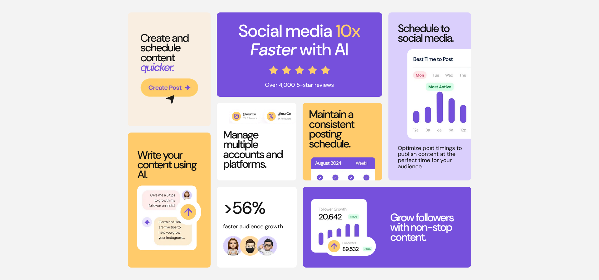

# Frontend Mentor - Bento grid solution

This is a solution to the [Bento grid challenge on Frontend Mentor](https://www.frontendmentor.io/challenges/bento-grid-RMydElrlOj). Frontend Mentor challenges help you improve your coding skills by building realistic projects.

## Table of contents

- [Overview](#overview)
  - [Screenshot](#screenshot)
  - [Links](#links)
- [Acknowledgments](#acknowledgments)

### Screenshot

### Links

- Solution URL: [Solution](https://www.frontendmentor.io/solutions/bento-grid---advanced-responsive-layout-using-css-grid-BHiv9z8Tjl)
- Live Site URL: [Live Demo](https://bento-grid-shrey.netlify.app/)

## Acknowledgments

Special thanks to [KimDoesCode](https://www.youtube.com/watch?v=OzAc3eC6WQg) for inspiring the solution!
